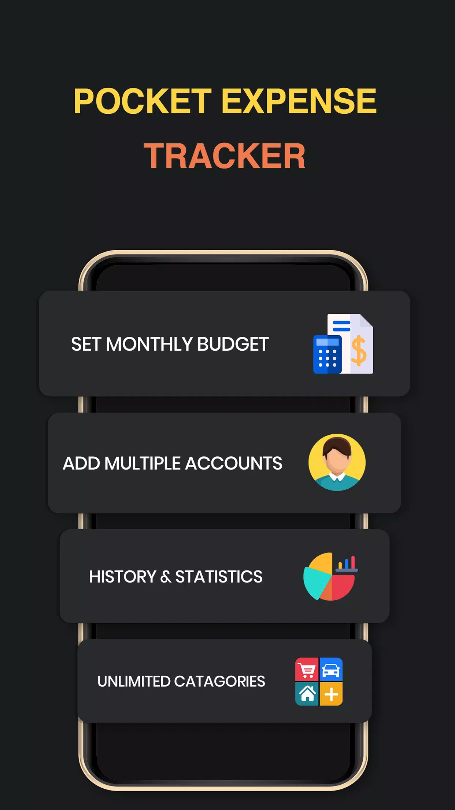
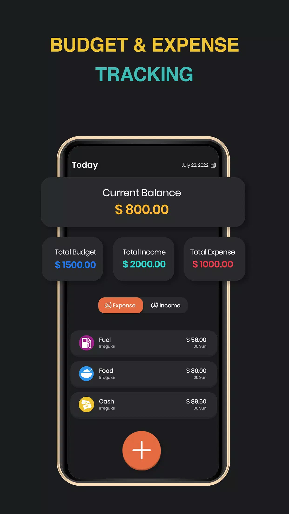
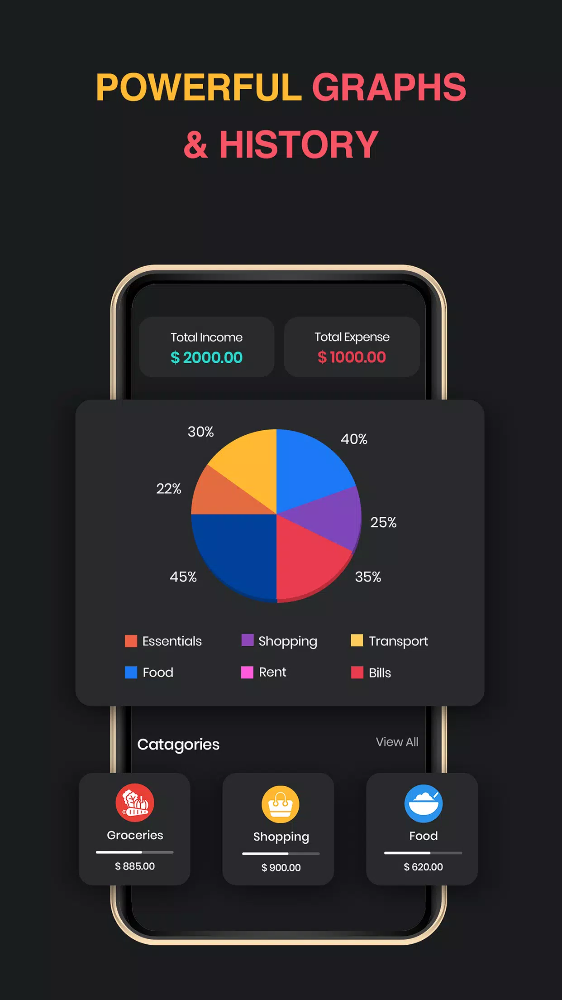
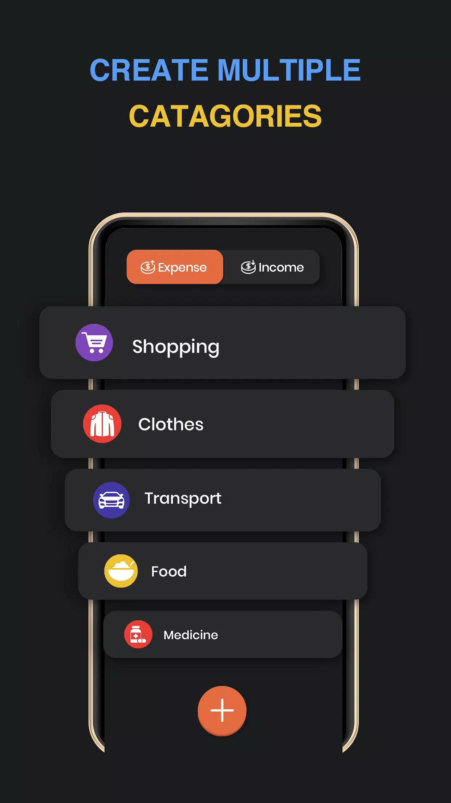
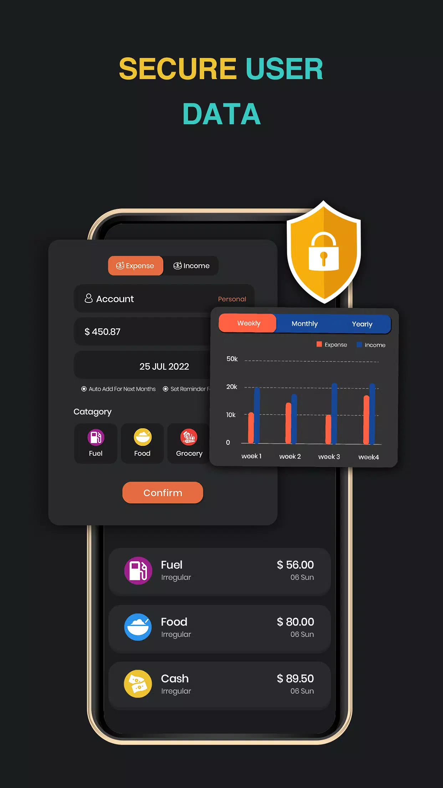
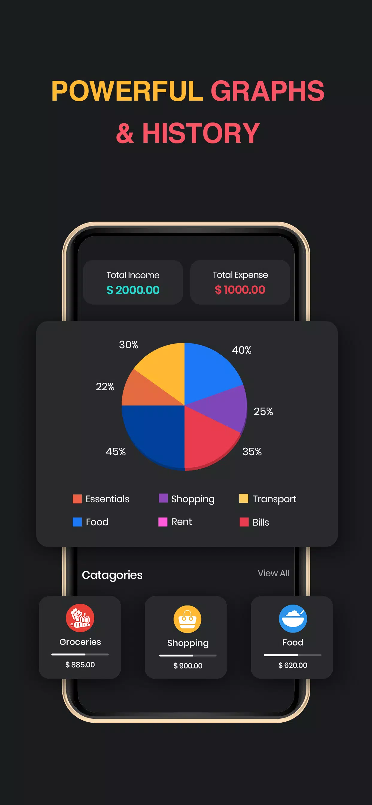
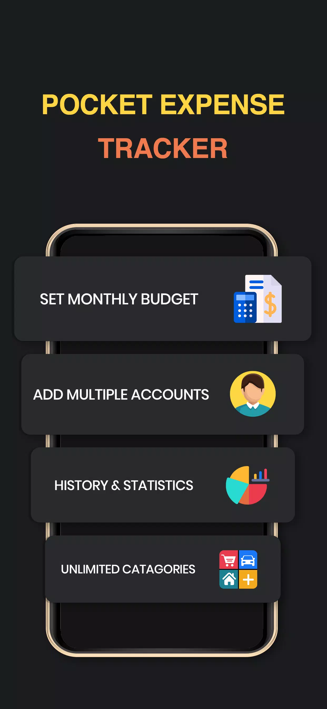
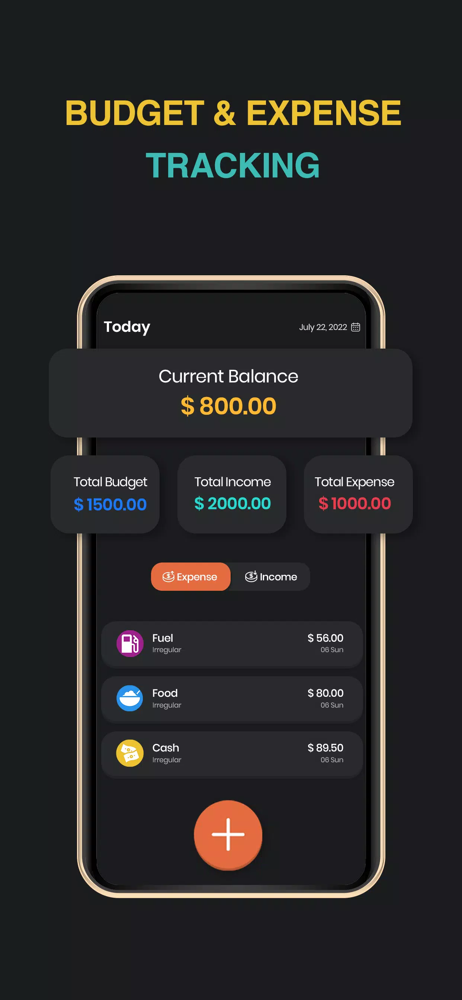

# Expense Manager — Track Your Expenses

A personal finance Android application for tracking income and expenses, managing budgets, and visualising spending habits.

---

## Features

- **Income & Expense Tracking** — Log transactions with category, account, date, amount, and an optional photo receipt
- **Budget Management** — Set monthly budgets per category with progress indicators
- **Multiple Accounts** — Track spending across cash, bank, card, or custom accounts
- **Custom Categories** — Create and icon-colour-code your own income/expense categories
- **Statistics & Charts** — Bar and pie charts for daily, weekly, and monthly breakdowns (powered by MPAndroidChart)
- **Transaction History** — Filterable list of all past transactions
- **Google Drive Backup** — Back up and restore the local database to/from Google Drive
- **Reminders** — Schedule daily spending reminders via local notifications
- **Dark Mode** — System-wide dark theme support
- **Multi-Currency** — Country/currency picker for international use
- **Intro Slideshow** — First-launch onboarding screens

---

## Screenshots

| Onboarding | Dashboard | Statistics |
|:---:|:---:|:---:|
|  |  |  |

| Categories | Add Transaction | Graphs & History |
|:---:|:---:|:---:|
|  |  |  |

| Onboarding (Portrait) | Dashboard (Portrait) |
|:---:|:---:|
|  |  |

---

## Tech Stack

| Layer | Technology |
|---|---|
| Language | Java |
| Min SDK | 23 (Android 6.0 Marshmallow) |
| Target SDK | 30 (Android 11) |
| Architecture | MVVM + Repository |
| Local DB | Room |
| UI | ViewBinding, Material Design 3 |
| Charts | MPAndroidChart (local module) |
| Image Loading | Glide |
| Cloud | Firebase (Analytics, Auth, FCM), Google Drive API v3 |
| DI / Lifecycle | AndroidX ViewModel + LiveData |
| Ads | Google Mobile Ads |

---

## Architecture

```
app/
├── activities/       # UI controllers (Activities)
├── adapters/         # RecyclerView & ViewPager adapters
├── app/              # Application class
├── dao/              # Room Data Access Objects
├── data/
│   ├── constant/     # App-wide constants
│   ├── models/       # Lightweight data transfer objects
│   └── preference/   # SharedPreferences wrapper
├── database/         # Room database, repositories, converters
├── entity/           # Room entities (Accounts, Budget, Categories, Spending)
├── fragments/        # UI fragments (Spending, History, Stats, Categories, Accounts)
├── google/           # Google Sign-In & Drive integration
├── libs/             # Bitmap utilities
├── utilities/        # Helpers (Alarm, Date, Dialog, File, Notifications…)
└── viewmodel/        # ViewModels (Account, Budget, Categories, Spending)

MPChartLib/           # MPAndroidChart local library module
```

---

## Prerequisites

- Android Studio **Arctic Fox** or later
- JDK 8+
- A Firebase project with **Analytics**, **Auth**, and **Cloud Messaging** enabled
- A Google Cloud project with the **Drive API** enabled and an OAuth 2.0 client ID

---

## Setup

1. **Clone the repository**
   ```bash
   git clone https://github.com/<your-username>/expense-tracker.git
   cd expense-tracker
   ```

2. **Add Firebase configuration**
   - Download `google-services.json` from your Firebase project console
   - Place it at `app/google-services.json`
   - ⚠️ This file is excluded from version control — do **not** commit it

3. **Add Google OAuth credentials** *(for Drive backup)*
   - Create an OAuth 2.0 Android client in the Google Cloud Console
   - The SHA-1 fingerprint must match your signing key

4. **Sync Gradle**
   ```
   File → Sync Project with Gradle Files
   ```

5. **Run the app**
   - Select a device or emulator running API 23+
   - Click **Run ▶**

---

## Key Dependencies

```groovy
// Architecture
implementation "androidx.room:room-runtime:2.2.5"
implementation "androidx.lifecycle:lifecycle-extensions:2.2.0"

// UI
implementation 'com.google.android.material:material:1.4.0'
implementation 'com.intuit.sdp:sdp-android:1.0.6'
implementation 'com.tbuonomo:dotsindicator:4.2'

// Charts (local module)
implementation project(':MPChartLib')

// Firebase & Google
implementation 'com.google.firebase:firebase-analytics:20.0.2'
implementation 'com.google.firebase:firebase-messaging:23.0.0'
implementation 'com.google.android.gms:play-services-auth:19.0.0'
implementation 'com.google.apis:google-api-services-drive:v3-rev136-1.25.0'

// Image
implementation 'com.github.bumptech.glide:glide:4.13.0'

// Misc
implementation 'com.google.code.gson:gson:2.8.9'
implementation 'com.github.scrounger:countrycurrencypicker:1.0.4'
implementation 'com.maltaisn:calcdialog:2.2.2'
```

---

## Permissions

| Permission | Reason |
|---|---|
| `INTERNET` | Firebase, Ads, Google Drive sync |
| `CAMERA` | Attach receipt photos to transactions |
| `READ/WRITE_EXTERNAL_STORAGE` | Save & share exported data |
| `ACCESS_NETWORK_STATE` | Check connectivity before Drive sync |
| `RECEIVE_BOOT_COMPLETED` | Restore scheduled reminders on reboot |

---

## License

This project is for portfolio and educational purposes.
